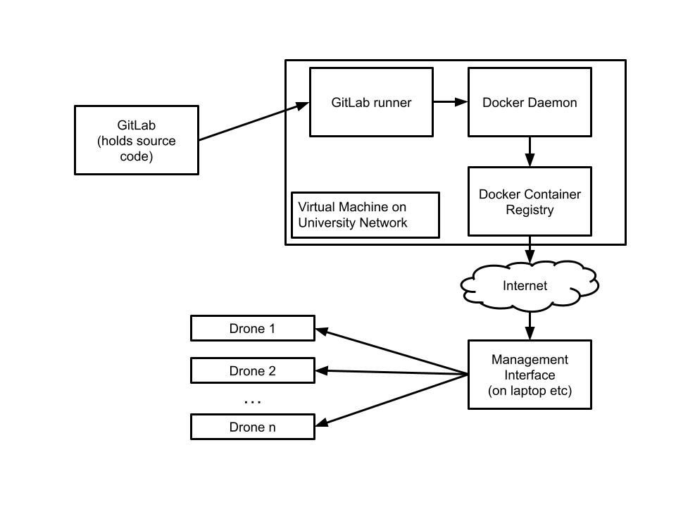

# Fast Formation Configuration
## Details



There are two main parts of this project. The first is the virtual machine, which automatically builds
and stores code pushed to the eng-git server.

### Virtual Machine

When inside the uc network, you can access the virtual machine over ssh (password: droneswarm)

```bash
ssh user@csse-sdff.canterbury.ac.nz
```

When you make a push to a branch, eng git uses the [.gitlab-ci.yml](../../../.gitlab-ci.yml)
file to run continuous integration. It sends that job to the gitlab runner, which clones the repo, 
before running the commands listed under script:

These commands build the docker image, and then make it publicly available from https://csse-sdff.canterbury.ac.nz
If you want to test out an image now, you can run

```bash
docker login csse-sdff.canterbury.ac.nz # Username: test, Password: testpassword
docker pull csse-sdff.canterbury.ac.nz/main #Or whatever branch name you would like the image for
```

Note that in the script we use a custom builder, and specify that when we build it we would like the platform to be
`linux/arm64/v8`. If we do not do this, the software will be incompatible with the drones' processor. 

### Management-Interface

#### Detecting Drones

We don't know ahead of time what the IPs of our drones will be if they are assigned using dhcp. For this reason, we
have to automatically detect them. To do this, we first identify all devices connected to the wifi network by sending
a packet to the broadcast MAC address. Then, we go through all the devices and ask if they are a drone by sending an
HTTP request to {their_ip}:5000/isDrone. Actual drones should respond with a 200 status, whereas other devices will not.

#### Transferring Software

The second important part is being able to transfer the software in the field without internet access.
The management interface allows you to pull down images and store them on your laptop, then transfer them to the drones
later. 

In order to transfer the images from the laptops to the drones, the system goes through a number of steps

1. On launch, create a certificate using `openssl` and start up the docker registry. We will use these later.
2. When a transfer is requested, copy the certificate over to the drone (using scp), and call `update ca-certificates`
to get docker on the drones to accept the new certificate.
3. Push the image requested for transfer to the docker registry
4. Synchronise the time on the laptop with the time on the drones. We need this for the security certificate validation,
but it is also handy for logging purposes. 
5. Run `docker pull` on the drones to begin the transfer process. 


