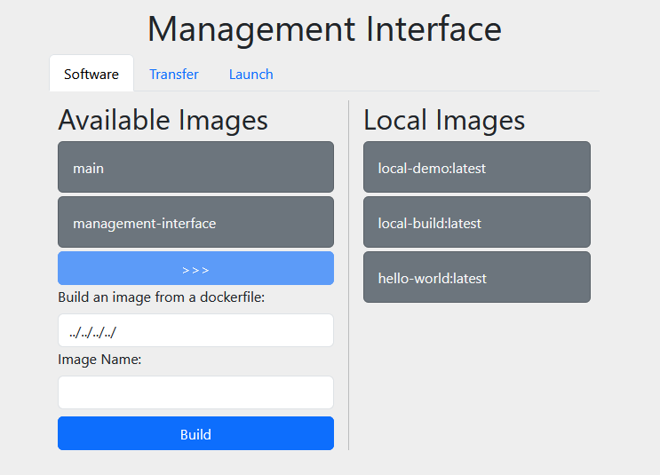
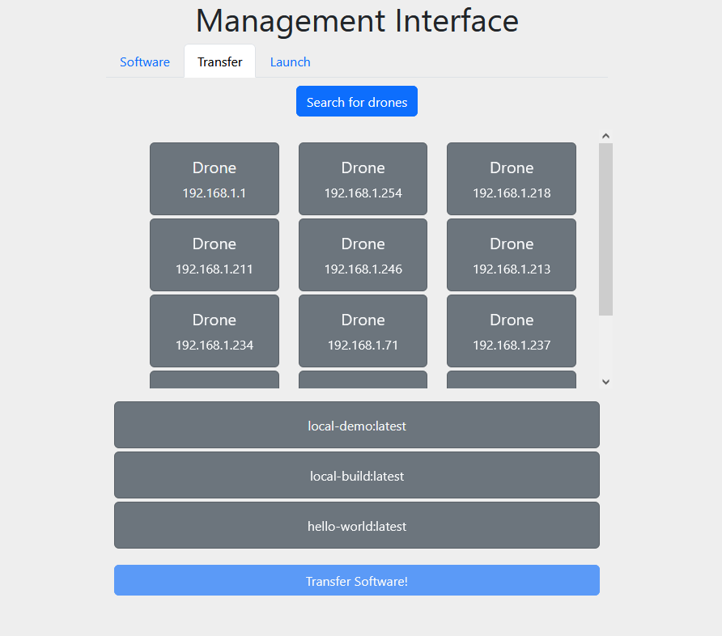
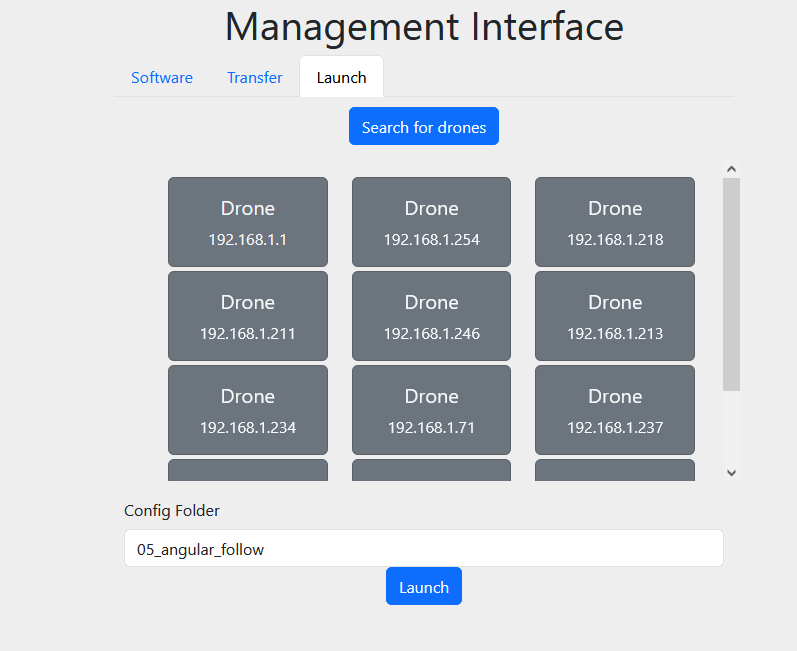

# Fast Formation Configuration
## Usage

The management interface consists of three pages.

### Software

Before going out into the field, you should use this page to chose what software you would like to take with you so that
you can transfer it on to the drones later. You can pick from pre-built images based on code that you have pushed to 
the eng-git server, or build an image from the current code on your local machine. 

### Transfer

The transfer page shows the drones it has detected connected to the wifi network, and also lists the software you have
available on your local machine. Select the drones you would like to transfer to, the image you wish to transfer, and
click transfer software to start. The process might be quite slow if this is the first image that has been sent to a 
particular drone, but later images should be faster. 

### Launch

When in the field, you can start the software running on particular drones by selecting them, inputting the config
folder you would like them to use, and then hitting launch. The drones should soar gracefully into the air :)