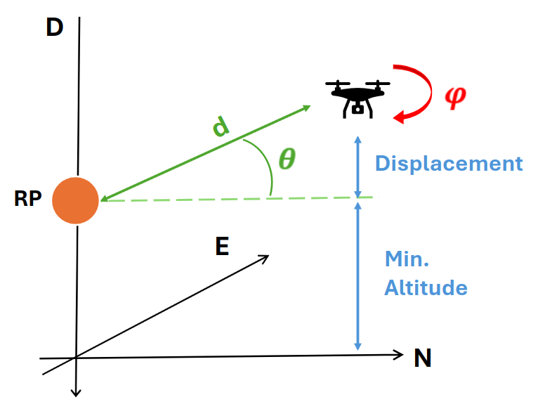

# Config Files

Configuration files are found at `uav-formations-fyp-*year*/swarm_ws/configs`

## Configuration Parameters

- **"id"** - This parameter is id of the drone.
- **"takeoff_height"** - This is the height drones will fly to on launch, before commencing rendezvous.
- **"alt_constraint"** - Contains constraints related directly to the altitude of the drone in the swarm.
  - "min_altitude" - The minimum altitude above the ground that the drone must always be at or above.
  - "height_displacement" - The height displacement above/below the reference point. 
  - "gains" - The P, I, D gain constants for this constraint.
- **"pos_constraint"** - Contains constraints related directly to the position of the drone in the swarm w.r.t the virtual reference point in an (x,y) -> (North, East) frame.
  - "distance" - The distance from the drone to the reference point.
  - "angle" - The polar angle from the reference point, where north is zero degrees. 
  - "gains" - The P, I, D gain constants for this constraint.
- **"heading_constraint"** - Contains constraints related directly to the altitude of the drone in the swarm.
  - "angle" - Represents the angular offsel with respect to the heading of the reference point. i.e. an angle of zero degrees means the drone will face the same way as the reference point.
  - "gains" - The P, I, D gain constants for this constraint.
  
  
A physical representation of the configuration is depicted below:  


## Example Config File

```json
{
  "id": 1,
  "takeoff_height": 3,
  "alt_constraint": {
    "min_altitude": 3,
    "height_displacement": 0,
    "gains": [2.2, 0, 0.2]
  },
  "pos_constraint": {
    "distance": 6,
    "angle": 0.0,
    "gains": [0.9, 0, 0.01]
  },
  "heading_constraint": {
    "angle": 0,
    "gains": [1, 0, 0]
  }
}
```