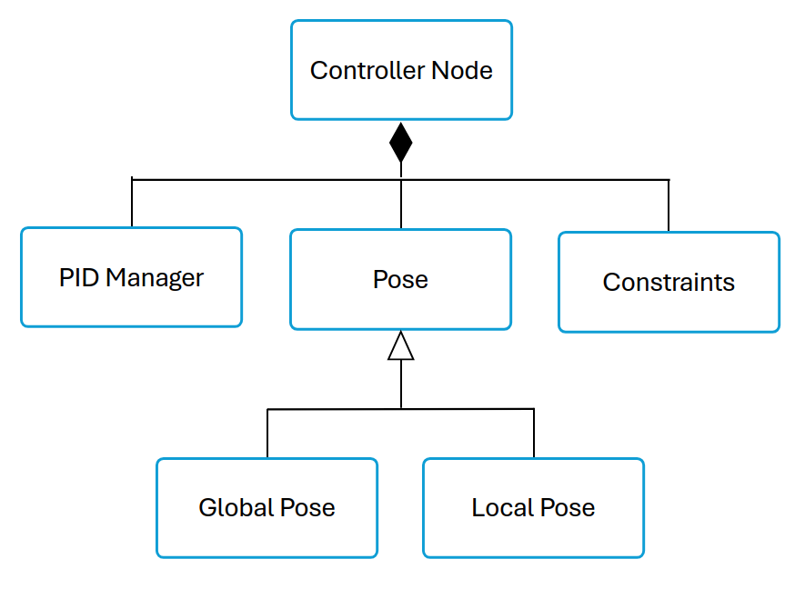
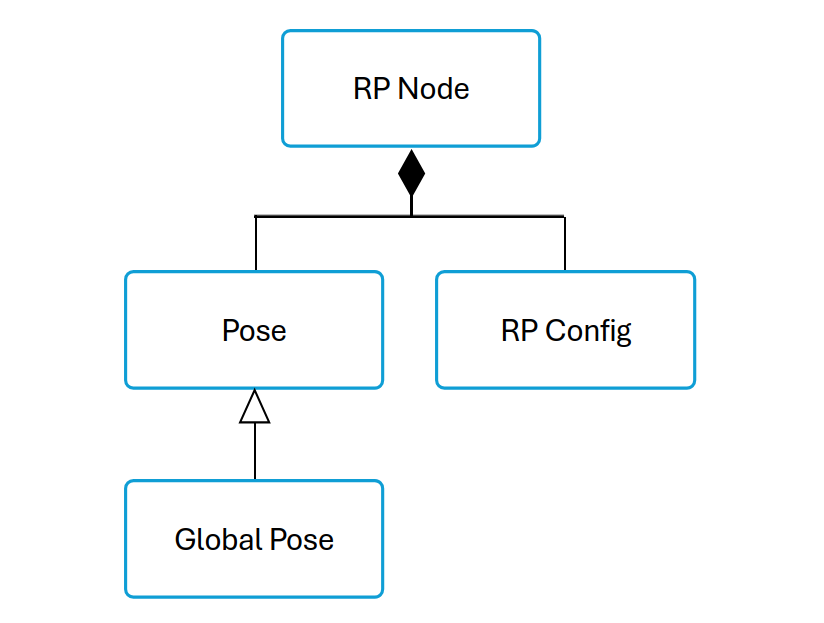

# Controller Node & Reference Point Implementation

Control/ReferencePoint code is found in uav-formations-fyp-*year*/swarm_ws/src/controller.  
UML diagrams for both the controller node and the reference point node are shown below:  
  

## controller_node.cpp

This is the main ros2 node for the controller. It runs a control loop that depending on the state sent to it from the lifecycle node, will control the position of the drone w.r.t the virtual reference point. This is done using ros2 timers. The controller essentially calculates the trajectory velocities for the drone and passes them too the PX4 FCU through the lifecycle node based on the error beteeen the drones current position and its goal position w.r.t the RP.

## config.cpp

The config class is used to maintain all drone constraints with respect to the virtual reference point. On startup each drone will have their own config class parsed from their individual config file.
Additionally, this also contains an config class for the reference point that essentially holds all of the drone constraints in the swarm, used to initialise its position.

## pose.cpp

The pose class is a generic class that contains the drones position in an x, y, z frame as well as the drones current heading.

### global_pose.cpp

The global pose subclass extends the functionality of the pose class by using a lat, lon, alt frame. This contains specific methods required to compute distances using GPS coordinates. Global pose is primarilarly used by the reference point, as this is virtual.

### local_pose.cpp

The local pose class is a subclass of pose extending the functionality to represent the North, East, Down frame used by the PX4 FCU.

## pid_manager.cpp 

This maintains the PID controllers for each of the drone constraints, alt, position, and heading. It is used fo find the error of the drone w.r.t its goal position and compute the flight corrections for the drone.  
The PID controllers used are provided by the ros2_control/control_toolbox library, available at [control_toolbox](http://docs.ros.org/en/rolling/p/control_toolbox/).

## ref_point.cpp

This is the node for the virtual reference point. On start up the reference point is instantiated from the global position of any drone in the swarm. Once the swarm has found formation the reference point in its current state will mimic the movement of the target.